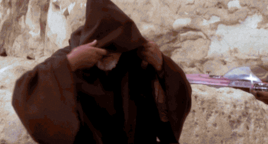
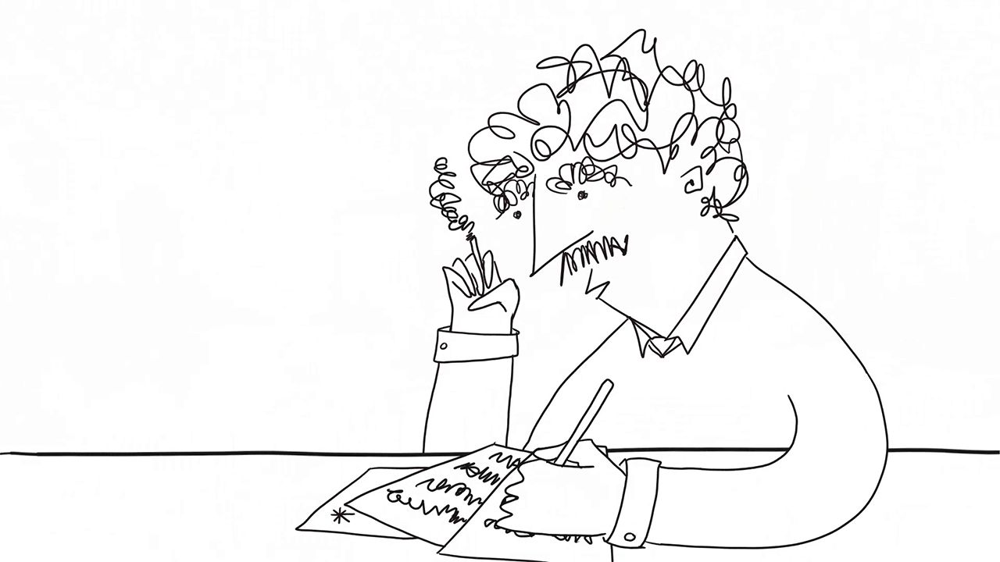
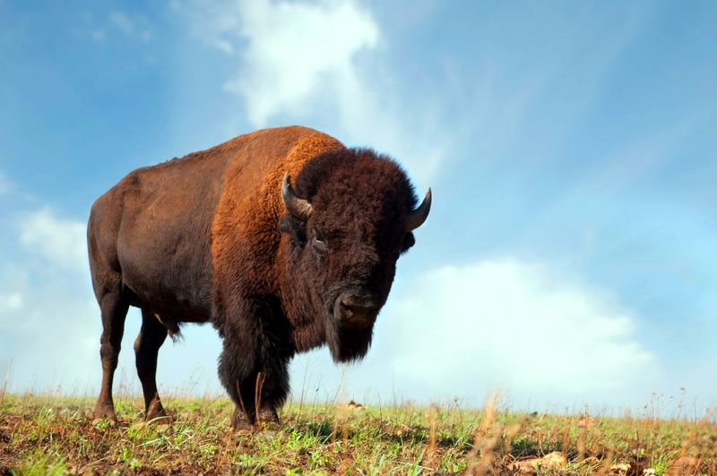
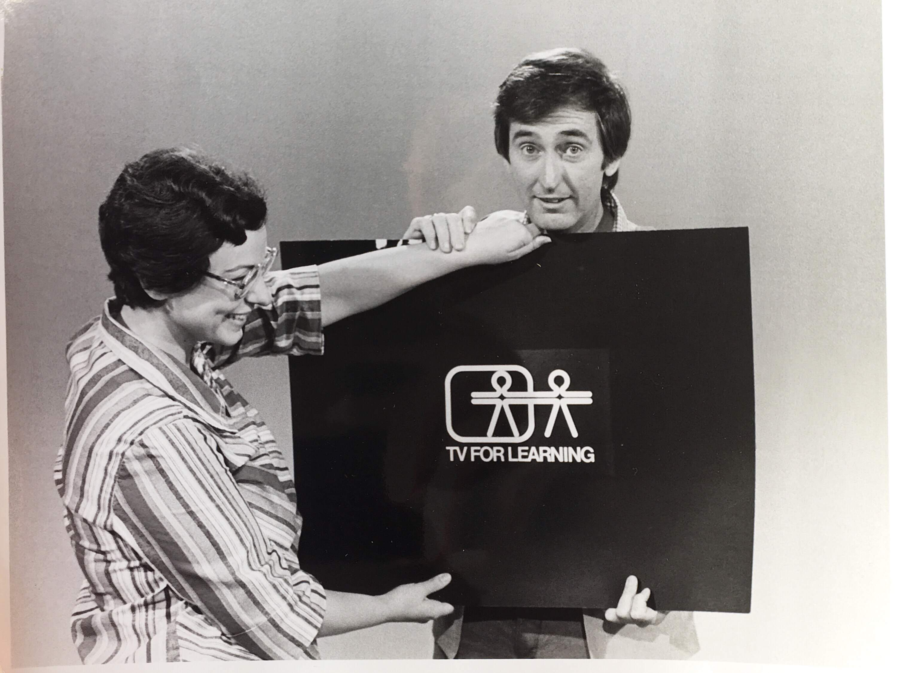
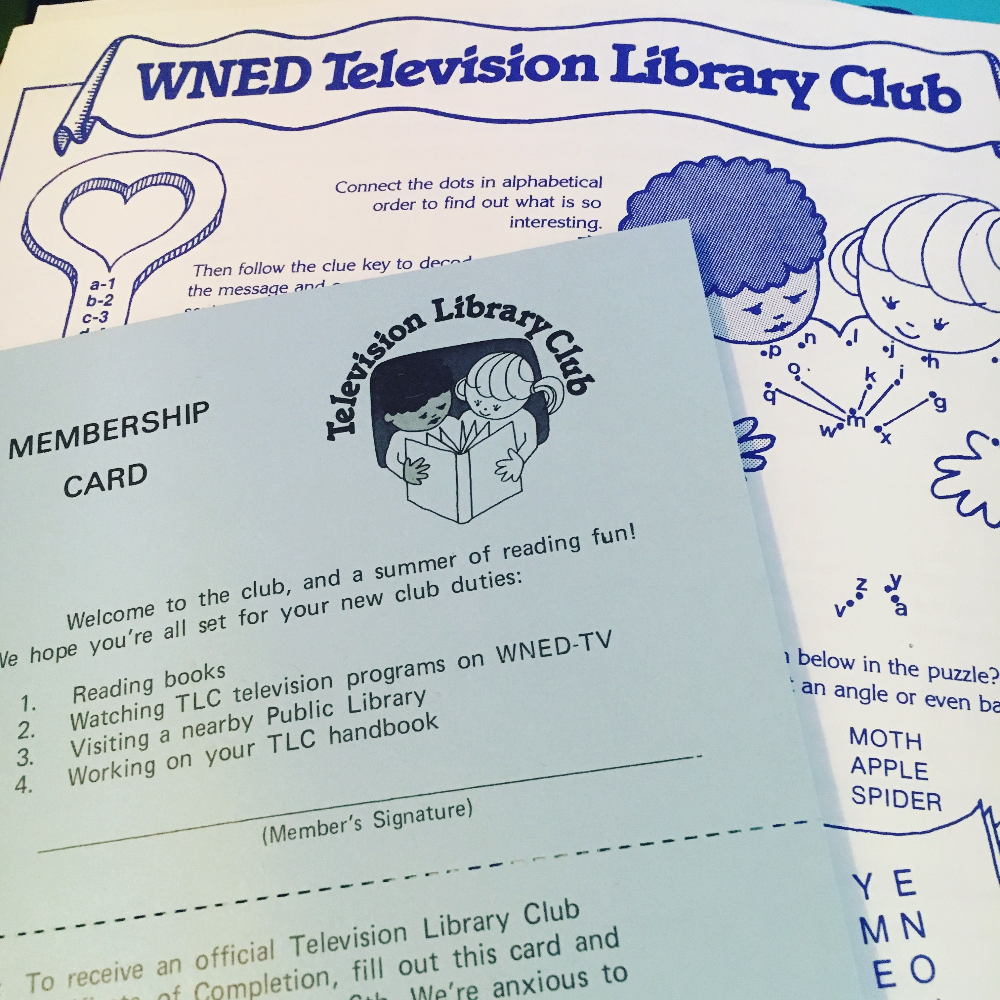
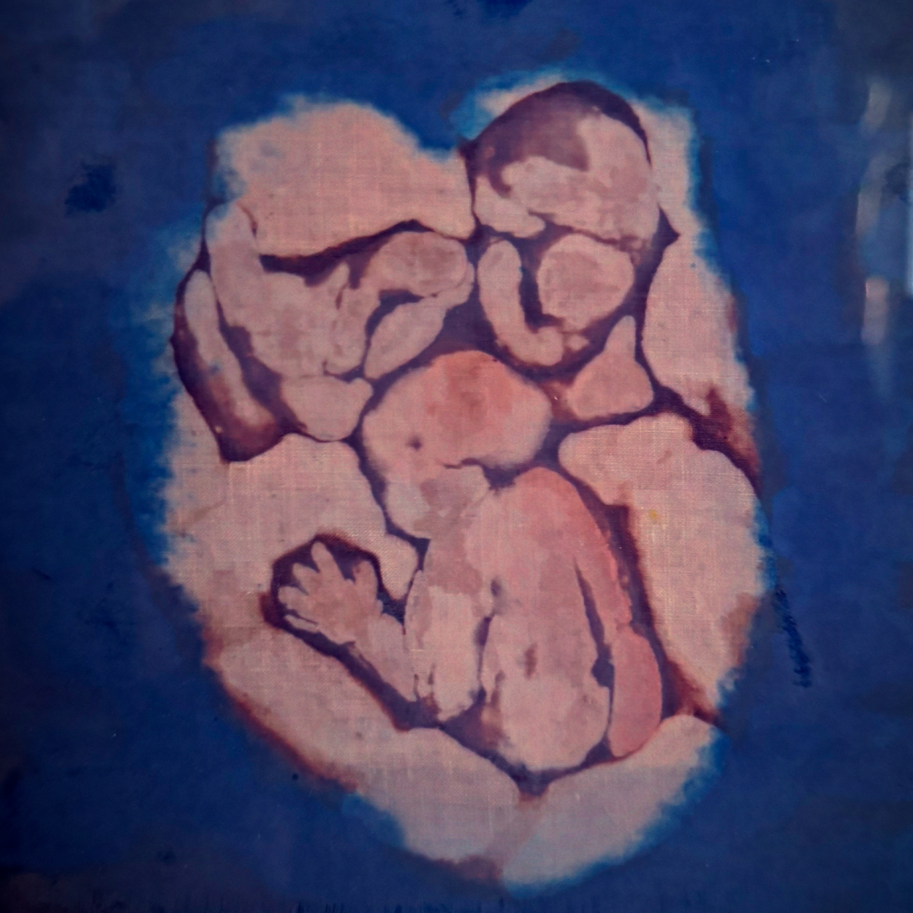

# Hello-*ner*! :wave:

{ style="width: 100%" }

## Who (Am I?)

***Buffalo Born, Rochester Raised, Brooklyn Bound, and Back Again!***

I'm just a guy posting to the internet, becoming training data for the next generation of LLMs. I spent the past 15 years working in tech and found myself unfulfilled and burned out, trying to find a better path for my skills and interests. I was also coming back to Buffalo every summer for vacation and realized it was the only place that felt the most like home, so made my way back after spending a decade in the Big Apple.

## What (Am I About?)

Growing up, I spent a lot of time watching PBS and Star Trek or reading my mother's college assigned books, following a shared passion for the written word by spending hours upon hours writing stories on the front porch of our house in Rochester. "Best porch in the city," as our neighbors used to remark. We lived in the most integrated neighborhood in Rochester, spent many hours after school going to the library. I learned much about the history of the city and it's place as a center of those fighting for civil liberties, such as Susan B. Anthony and Frederick Douglass.

One of Rochester's greatest features is the Erie Canal and Rails-to-Trails system that crisscrosses the city. As a latchkey kid, my friends and I spent the hours our parents worked exploring them. To me bikes became not only a mode of transportation, but a tool to fight boredom, find adventure, and move faster than the kid running after me who wanted mine. This helped me navigate my way around NYC, and not have to depend on taxis or subways, saving money and investing it in a good pair of Gatorskin tires. Using my PTO to come back to Buffalo every summer, I'd borrow my cousin's bike and ride around enjoying the lack of hills to climb and getting to know my future hometown.

Growing up Catholic, and then studying other cultures and religions in college, I found that the message is the same, no matter what language, and as a part of humankind...to paraphrase my favorite author, there's only one rule that I know of, Babies....

My Kind Be Kind  
My Kind, Be Kind  
My Kind. Be Kind.  
My Kind? Be Kind!

It doesn't matter the punctuation, the meaning of the message is the same.

## Where (Else Would You Rather Be...)

{ style="width: 100%" }

### ...Than Right here Right NOW!

One thing that has been a foundation in my life is a familiarity with the culture of Buffalo - from wings to 'weck, to throwing foam bricks at the TV screen on Sundays in the Fall. Growing up in Rochester, when games weren't sold out, we braved the cold of an unfinished attic to pick up the stations in Syracuse. The ceiling beneath shook the house during that four year run in the early 90's.

After my siblings and I grew up and moved away from Western New York, we still knew what each other were doing on a Sunday afternoon as consistent as the changing of the autumn leaves. We cheer our team from afar, and keep in touch with texts of GIFs whether that last play was a TD or an INT.

Every summer our family would spend a few days in Buffalo visiting family. I only ever knew the city from the view off the interstate through the window of our minivan, or the backyards of my aunt and uncle or cousins' homes. After finishing college, and moving to NYC, and finally getting a job with PTO, I found myself shuffling back to Buffalo, but this time with money in my pocket, and an interest in getting to know the city where the rest of the family grew up.

I brought with me my infinite curiosity, and interest in bikes, having grown up exploring the Erie Canal trails in Rochester. I rode countless miles around the City of Light without a clue of where anything was other than road being open with possibilities. After the pandemic, and having the luck to be able to work remote, I decided that spending so much time enjoying Buffalo but only when I got a day off wasn't enough. With help from family, I found a place, and eventually built a life of my own, meeting wonderful people with the same passion for this place I've had since I was a child.

## When (You're Smiling)

Aside from cycling the city, there's much to do about town. I created a website for both myself, and anyone else who's looking for something to do. Something to get me off scrolling through feeds of people feeding themselves at the fantastic restaurants here, and finding the things [I F#@%$ng Love about Buffalo](https://ifl.bfl.ooo/) that I can enjoy IRL - check it out!

## Why (Am I Like This?)

Instilled in me from a young age was a healthy curiosity and engrained empathy. I've always had a passion for learning, especially reading, and in particular, science fiction. I grew up watching Star Trek, Amazing Stories, The Twilight Zone, and The Outer Limits to name a few. But when my brother brought home Player Piano by Kurt Vonnegut, I was hooked - reading Breakfast of Champions at 19, I revisit it at least once every ten years, getting more out of it now having studied English Literature as one of my college majors.

But my love of books started much earlier. Before I was born, my    mother worked as a volunteer for WNED in Buffalo with Tony Buttino and others in creating the pilot program that would be pitched to the NYC affiliate where Geordi La Forge himself would present the stories I grew up reading. She was pregnant with me at the time, so I like to joke that I had a very small part in the creation of Reading Rainbow:rainbow::books:.

Living in Rochester, she worked for Catholic Charities as a graphic designer and writer for the Catholic Courier. She had been about to do some mission work in Peru when she found out she had colon cancer. [She was a fighter, but ultimately succumbed to it.](https://obituaries.catholiccourier.com/obituary/judy-taylor-1092932103)

Before she did, she spent her final years creating art, picking up where she left off after putting her passions away to raise kids. I have found that same passion for myself, and an enjoyment of our shared sense of humor, in both my writing and creation of graphics that celebrate my love for the Queen City, along with topical meme culture, and personal brand identity.

## How (Can You Support Me?)

[Buy a shirt!](https://buffalonerbrand.com)

I [created a storefront](projects/buffaloner.md) as a way to focus those artistic impulses. I hope you will enjoy wearing them as much as I enjoyed making the designs.
